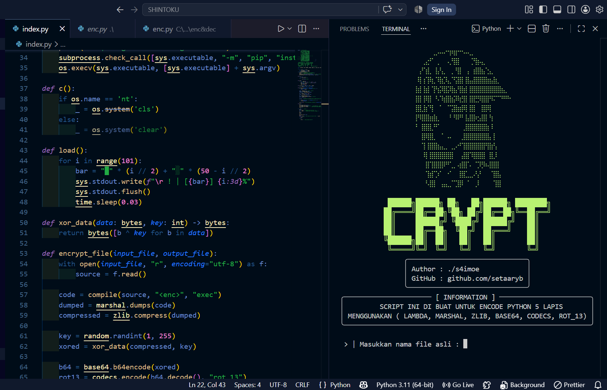

# CRYPT

<p align="center">
  
</p>

Simple Python encoder yang menggunakan beberapa layer encoding seperti **Marshal, Zlib, XOR, Base64, ROT13,** dan **Lambda Loader**.

## Features

- 5 Layer Encoding
- Random XOR Key
- Rich Terminal UI
- Auto Install Dependency
- Windows & Linux Support

## Installation

```bash
git clone https://github.com/setaaryb/crypt.git
cd crypt
pip install rich
python index.py
```

## Usage

```text
> Masukkan nama file asli :
main.py

> Simpan hasil terenkripsi sebagai :
main_enc.py
```
